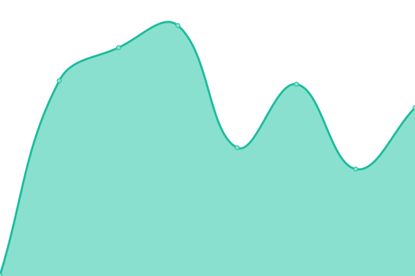

# [📈 Live Status](https://upptime.github.io/upptime): <!--live status--> **Todos los sistemas estan operativos**

This repository contains the open-source uptime monitor and status page for [Upptime](https://upptime.js.org), powered by [Upptime](https://github.com/upptime/upptime).

With [Upptime](https://upptime.js.org), you can get your own unlimited and free uptime monitor and status page, powered entirely by a GitHub repository. We use [Issues](https://github.com/upptime/upptime/issues) as incident reports, [Actions](https://github.com/Asimovers/cl-asimov-uc-status/actions) as uptime monitors, and [Pages](https://upptime.github.io/upptime) for the status page.

<!--start: status pages-->
<!-- This summary is generated by Upptime (https://github.com/upptime/upptime) -->
<!-- Do not edit this manually, your changes will be overwritten -->
<!-- prettier-ignore -->
| URL | Status | History | Response Time | Uptime |
| --- | ------ | ------- | ------------- | ------ |
|  [Portal UC](https://uc.cl) | Activo | [portal-uc.yml](https://github.com/Asimovers/cl-asimov-uc-status/commits/HEAD/history/portal-uc.yml) | 

 1578ms
     
 | 

<a href="https://status.uc.asimov.cl/history/portal-uc">100.00%</a>
    

|  [Sitio Kit Digital](https://kitdigital.uc.cl) | Activo | [sitio-kit-digital.yml](https://github.com/Asimovers/cl-asimov-uc-status/commits/HEAD/history/sitio-kit-digital.yml) | 

 486ms
     
 | 

<a href="https://status.uc.asimov.cl/history/sitio-kit-digital">100.00%</a>
    

|  [Api Agenda UC](https://api.agenda.uc.asimov.cl/) | Activo | [api-agenda-uc.yml](https://github.com/Asimovers/cl-asimov-uc-status/commits/HEAD/history/api-agenda-uc.yml) | 

 267ms
     
 | 

<a href="https://status.uc.asimov.cl/history/api-agenda-uc">100.00%</a>
    

|  [Sitio Agenda UC](https://cl-uc-agenda-front.netlify.app/) | Activo | [sitio-agenda-uc.yml](https://github.com/Asimovers/cl-asimov-uc-status/commits/HEAD/history/sitio-agenda-uc.yml) | 

 225ms
     
 | 

<a href="https://status.uc.asimov.cl/history/sitio-agenda-uc">100.00%</a>
    

<!--end: status pages-->

[**Visit our status website →**](https://upptime.github.io/upptime)

## 📄 License

- Powered by: [Upptime](https://github.com/upptime/upptime)
- Code: [MIT](./LICENSE) © [Upptime](https://upptime.js.org)
- Data in the `./history` directory: [Open Database License](https://opendatacommons.org/licenses/odbl/1-0/)
